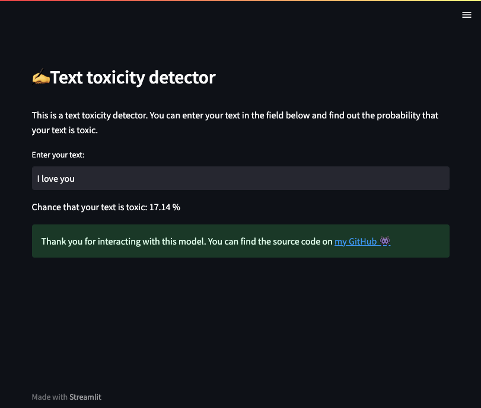

## ✍️Text toxicity detector
### Description
An app that determines how likely your text (user input)
is to be toxic. Designed for 
deployment on streamlit.

- The nltk library was used to lemmatize the text.
- Creation of features from text data was done with TF-IDF method.
- Naive Bayes is chosen as a predictive model.  

You can find data processing and model development in the notebook.ipynb file.  
You can interact with deployed model [on streamlit 👾](https://fpsgames.streamlit.app/)
### References
Data source is [kaggle.com](https://www.kaggle.com/datasets/ashwiniyer176/toxic-tweets-dataset?resource=download)
### Screenshot of the steamlit app

